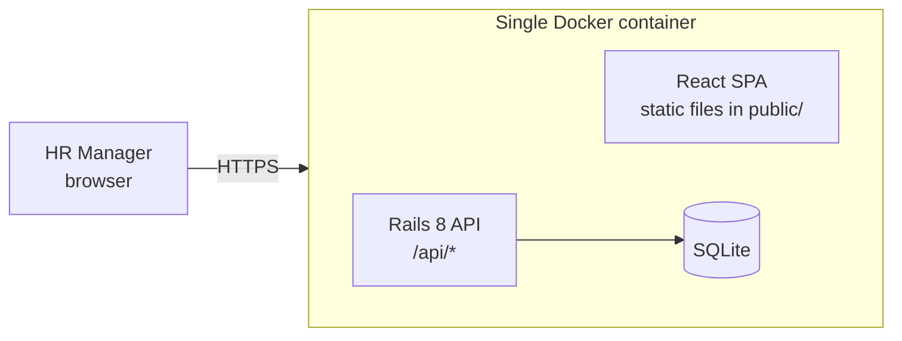

# Design Notes

## Architecture



- **Rails 8 (API mode)** serves JSON under `/api` and the built React app from `public/`, with an SPA fallback
  for client-side routes. One process and one image, so deployment stays simple.
- **SQLite**: ample for 10k rows and a single-writer HR workload; zero ops. The data access layer
  is plain ActiveRecord, so moving to Postgres is a config change (see trade-offs).
- **React + TypeScript (Vite)** with **Mantine** components, **TanStack Query** for server state
  (caching, loading and error states) and **React Router**.

### Backend layering

| Layer | Responsibility |
|-------|----------------|
| `Employee` model | Persistence, validations, currency derived from country |
| `Countries` (PORO) | Supported countries, mapped to ISO-4217 currency |
| `EmployeeSearch` (query object) | Filtering, search, whitelisted sorting and pagination: keeps controllers thin and is unit-testable |
| `SalaryStatistics` (PORO) | Pure min/max/mean/median/percentile maths on a list of integers |
| `SalaryInsights` (service) | Composes SQL aggregates plus `SalaryStatistics` for country, job-title and department views |
| Controllers | HTTP ↔ domain translation, status codes, error envelope |

## Data model

```
employees
  id            integer  PK
  full_name     string   not null
  email         string   not null, unique (case-insensitive, stored lowercase)
  job_title     string   not null
  department    string   not null
  country_code  string(2) not null   ISO-3166 alpha-2
  currency      string(3) not null   ISO-4217, derived from country
  salary        integer  not null, > 0   annual gross, whole units of local currency
  hired_on      date     not null, not in the future
  created_at / updated_at

indexes: email (unique), country_code, [country_code, job_title],
         [country_code, department], job_title, department, full_name
```

**Why integer whole units?** Annual salaries are never negotiated in cents, and integers avoid
floating-point money bugs. (A payroll system would use minor units; that is out of scope.)

**Why store `currency` if it is derived?** It freezes the currency the salary was recorded in.
If a country's currency mapping ever changes, historic records stay correct.

## API contract

All responses are JSON. Errors use one envelope: `{ "errors": { field: [messages] } }` or `{ "error": "message" }`.

| Method & path | Purpose |
|---------------|---------|
| `GET /api/employees?q=&country=&department=&job_title=&sort=&direction=&page=&per_page=` | Paginated list: `{ data: [...], meta: { page, per_page, total, total_pages } }` |
| `GET /api/employees/:id` | One employee |
| `POST /api/employees` | Create (`201`, or `422` with field errors) |
| `PATCH /api/employees/:id` | Update (`200` / `422`) |
| `DELETE /api/employees/:id` | Delete (`204`) |
| `GET /api/lookups` | Countries (with currency), departments, job titles for forms and filters |
| `GET /api/insights/countries` | Org overview: per-country headcount, currency, min / max / avg / median |
| `GET /api/insights/countries/:code` | One country: summary stats plus breakdown by job title and by department |

`sort` is whitelisted (`full_name, job_title, department, country_code, salary, hired_on`) to
prevent SQL injection through `ORDER BY`. `per_page` is clamped to 1..100.

## Key trade-offs

| Decision | Alternative | Why |
|----------|-------------|-----|
| SQLite | Postgres | 10k rows, one HR team: SQLite is fast enough and has no ops overhead. Postgres is the upgrade path if concurrent writers or analytics grow. |
| Offset pagination | Keyset/cursor | Users jump to page N and sort by arbitrary columns; offset cost at 10k rows is negligible. |
| All stats (incl. median, p25/p75) in Ruby over one `pluck` of (group, salary) pairs | SQL `GROUP BY` for min/max/avg plus window functions for percentiles | *Revised during build:* a single query feeding one pure `SalaryStatistics` class means every figure on a screen comes from the same data and the same maths (no SQL-vs-Ruby rounding mismatch). Portable across SQLite/Postgres and trivially unit-tested; plucking ≤10k integer pairs takes milliseconds (see performance notes). Percentiles match Excel's `PERCENTILE.INC`. |
| Mono-image (Rails serves SPA) | Separate frontend host + CORS | One deployable, no CORS, same origin. |
| No auth | Devise / SSO | Out of scope (see requirements); would be SSO in production. |
